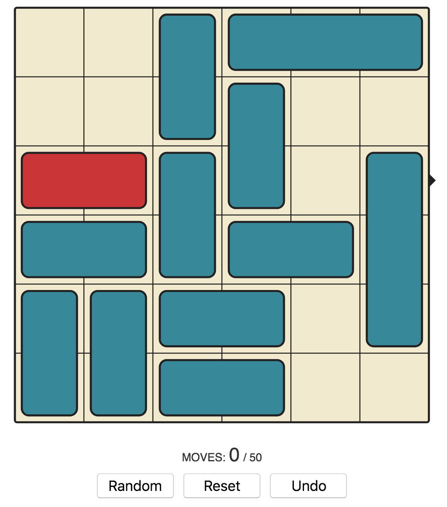

#THE TRAFFIC JAM GAME#
##for ages 5+##
###By Anna Peterson, *Web Developer*###
<annapeterson@gmail.com>

##Overview##

#####The Traffic Jam Game is a logic puzzle that requires a player to manipulate blocks in order to help one escape the puzzle. Many variations on the Traffic Jam Game are sold in toy stores and puzzles of this type have held broad appeal for players  the game continues to hold strong appeal for people of all ages and has inspired many similar games, including this one! Puzzles teach us patience, reasoning, and planning. These skills all come in handy for coders.#####

##Who is this game for?##

This game is for Axel Peterson, a 5 year old boy living in Orem, Utah who loves puzzles. He is getting ready to start big boy kindergarten and his mother and father are always looking for ways to satisfy his intellectual curiosity and keep him occupied. 

This game is for Steve, a 60-something year old man who enjoys puzzles to keep his mind occupied and sharp. He travels often and wants to have a simple, rewarding game on hand to pass the time. 

This game is for me, Anna Peterson! I loved this game 

##Wireframe##

##Technologies Used##

The Traffic Jam Game is written in HTML, CSS, and Javascript with the help of Canvas and Bootstrap.

##Getting Started##

The instructions are simple, but the game is tricky! Get your little red car out of traffic by moving towards the exit. Click and drag to move the vehicles. They may only move in either a horizontal or vertical direction. See how quickly you can solve it or shoot for solving the problem in the minimum number of moves!

##Next Steps##

The Traffic Jam game always has more possibilities for extra levels and problems. Some versions of the game include walls for added difficulty. 

